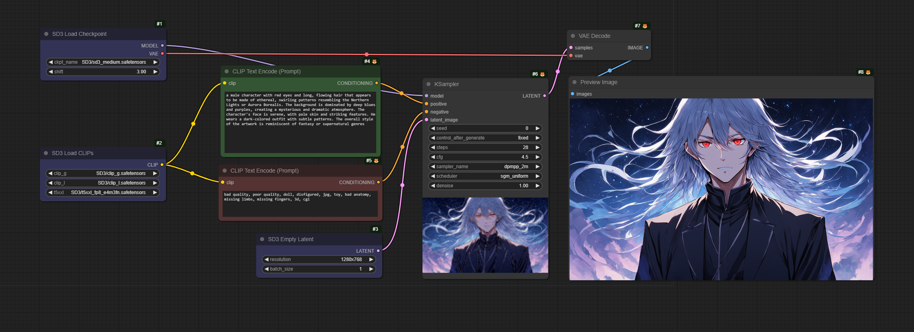

# ComfyUI-SD3-nodes

Nodes that support Stable Diffusion 3 Medium and are a little bit easier to understand. They are a wrapper of ComfyUI's built-in nodes.

Download the [JSON format workflow](workflows/sd3-default-workflow.json)

## Requirements

 - Upgrade `ComfyUI` to the latest version. You can either use `ComfyUI-Manager` to update, or run `git pull` in the `ComfyUI` folder.

## Node List:

### 1. SD3 Load Checkpoint

Load the SD3 models.

 - `ckpt_name`: Choose the SD3 model. If you don't have the model, please go to [Huggingface](https://huggingface.co/stabilityai/stable-diffusion-3-medium/blob/main/sd3_medium.safetensors), provide personal information and download it.

 - `shift`: A hyperparameter. According to the [SD3 paper](https://arxiv.org/pdf/2403.03206), it works best at 3.0 and 6.0.

### 2. SD3 Load CLIPs

Load the three CLIPs SD3 borrows: 
[CLIP-G](https://huggingface.co/stabilityai/stable-diffusion-3-medium/blob/main/text_encoders/clip_g.safetensors),
[CLIP-L](https://huggingface.co/stabilityai/stable-diffusion-3-medium/blob/main/text_encoders/clip_l.safetensors),
[T5 XXL](https://huggingface.co/stabilityai/stable-diffusion-3-medium/blob/main/text_encoders/t5xxl_fp8_e4m3fn.safetensors)

 - `clip-g`: Choose the CLIP-G model.

 - `clip-l`: Choose the CLIP-L model.

 - `t5xxl`: Choose the T5 XXL model.

